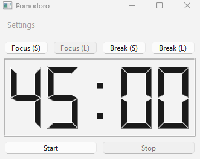
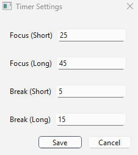
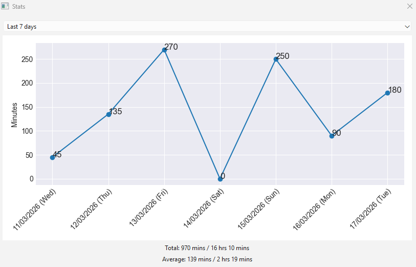

# POMODORO
A pomodoro timer created using PySide6
## Usage
### Option 1 (Using Python):
Run `main.py` (e.g., Windows: `py main.py`, Linux: `python3 main.py`)
### Option 2 (Using executable):
Download the pomodoro.zip folder for the respective machine and run the pomodoro executable. ([Windows](PyInstaller/Windows/pomodoro.zip), [Linux](PyInstaller/Linux/pomodoro.zip))

## Features
- [X] Include 4 different timer profiles (up to 60 minutes)
- [X] Short chime when timer ends 
- [X] Settings to change timer durations and chime sound 
- [X] Viewing of timer completion recent stats with flexible date range

## Interface
Pomodoro: \

Timer Settings: \

Stats: \

## Dependencies:
- `pyside6`
- `playsound3` 
- `pandas`
- `matplotlib`